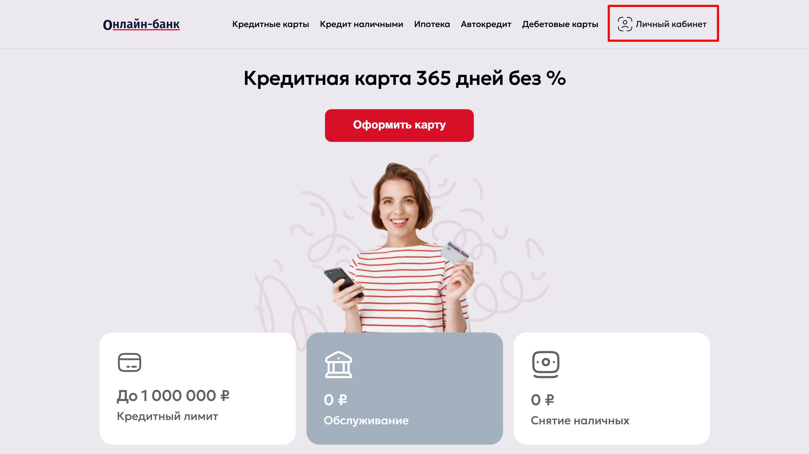
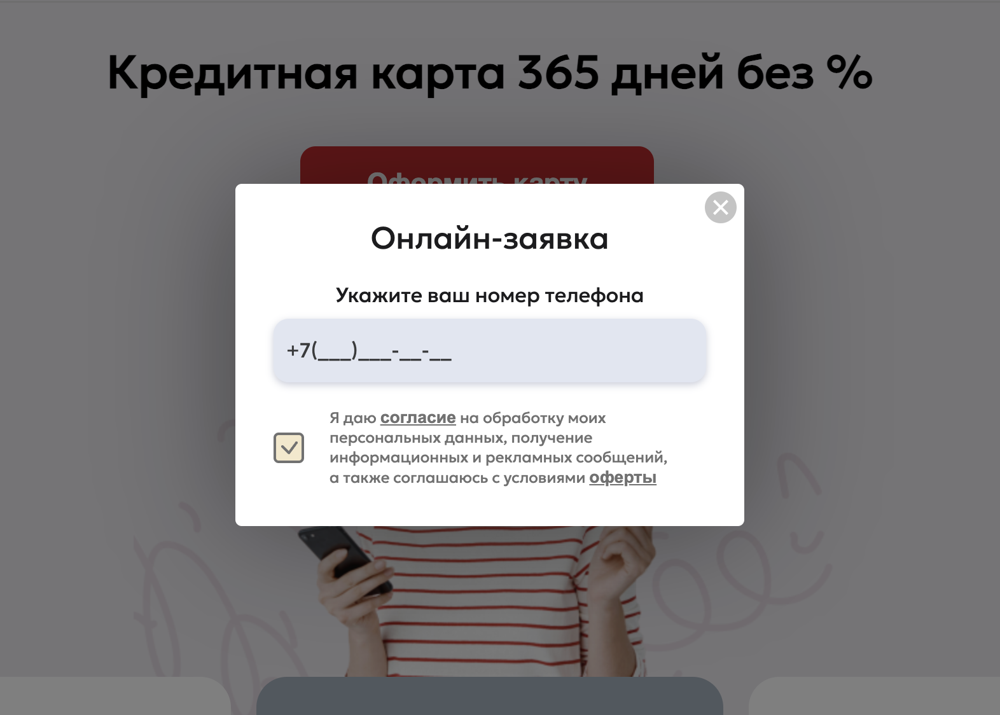
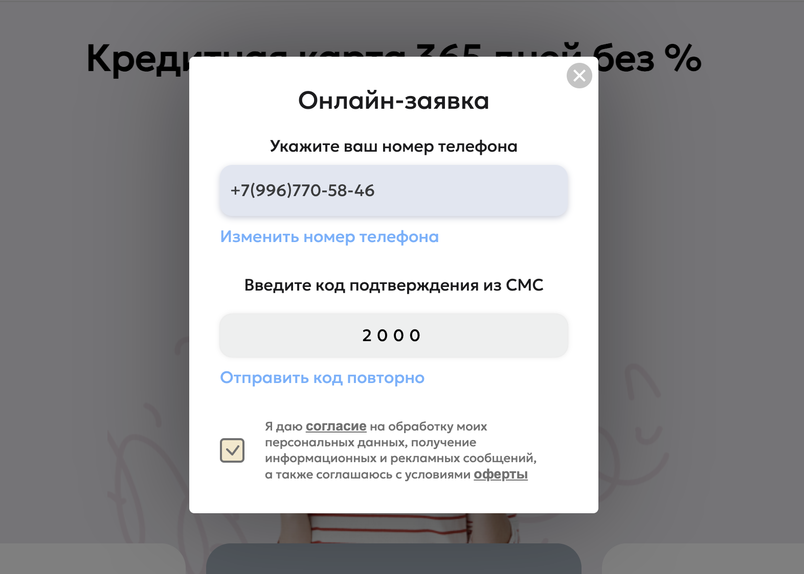
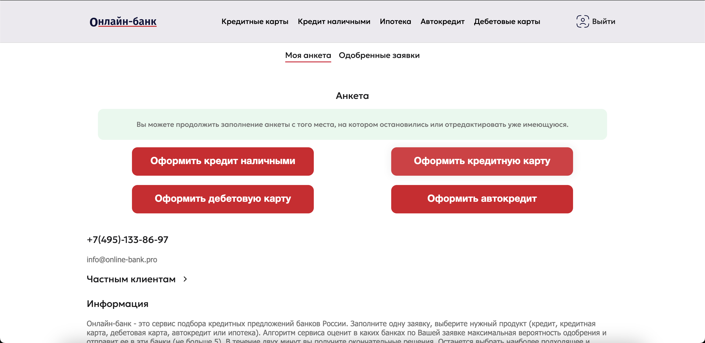
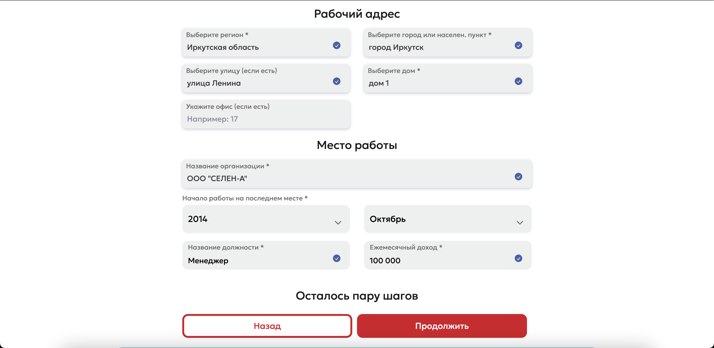
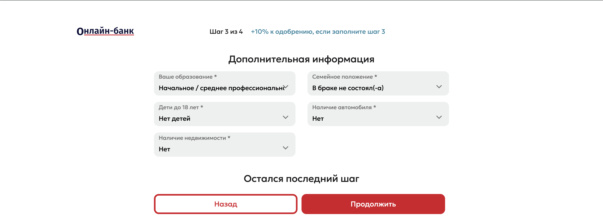
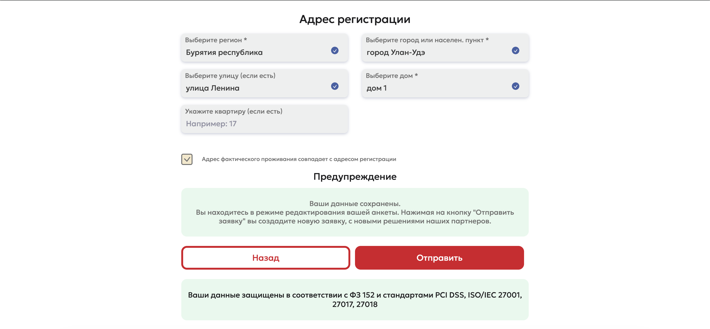
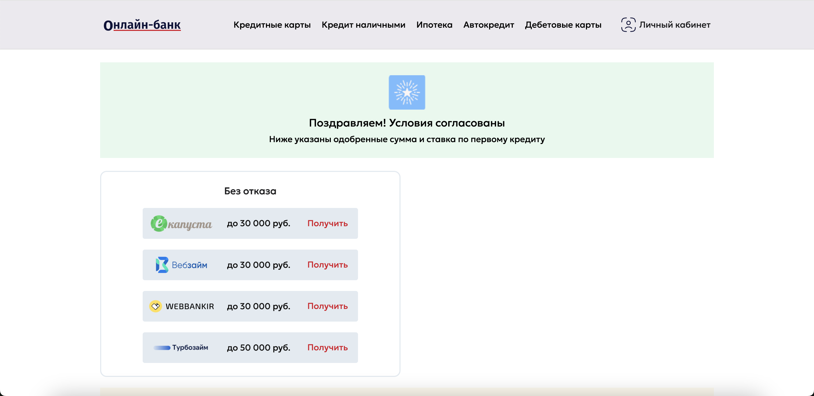
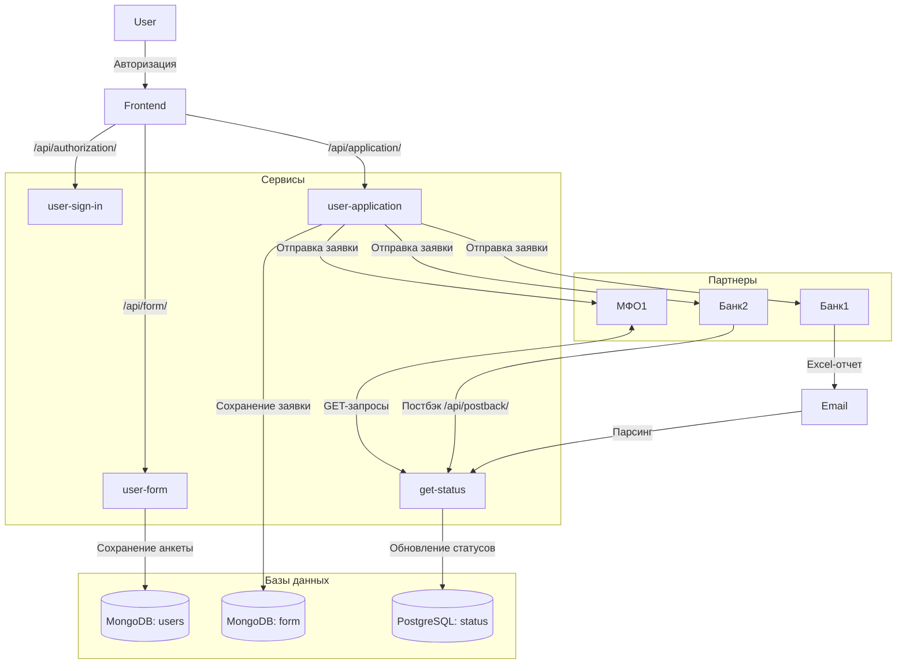

# Процесс авторизации, заполнения анкеты и получения статусов на onlinebank.pro

## Содержание
- [1. Процесс авторизации](#1-процесс-авторизации)
- [2. Заполнение анкеты](#2-заполнение-анкеты)
- [3. Отправка заявок партнерам](#3-отправка-заявок-партнерам)
- [4. Получение статусов от партнеров](#4-получение-статусов-от-партнеров)
- [5. Хранение данных](#5-хранение-данных)
- [6. Анализ кода сервиса get-status](#6-анализ-кода-сервиса-get-status)
- [7. Схема процесса](#7-схема-процесса)

## 1. Процесс авторизации

### 1.1 Переход на главную страницу и вход в личный кабинет

Пользователь переходит по ссылке [`https://onlinebank.pro`](https://onlinebank.pro) на главную страницу сервиса. Для входа в личный кабинет пользователь нажимает на кнопку "Личный кабинет", расположенную в верхней части страницы.

### 1.2 Авторизация по номеру телефона

В открывшемся окне авторизации пользователь вводит свой номер телефона в соответствующее поле (в данном случае +79967705846).

### 1.3 Отправка запроса на авторизацию

Фронтенд приложения отправляет запрос на backend по адресу `/api/authorization/` в сервис `user-sign-in`.

### 1.4 Подтверждение номера телефона

Пользователь получает SMS-сообщение с кодом подтверждения (в данном случае 2000). Пользователь вводит полученный код в поле.

### 1.5 Доступ к личному кабинету

После успешного ввода кода подтверждения пользователь перенаправляется в свой личный кабинет.

## 2. Заполнение анкеты
1. Пользователь заполняет анкету, указывая необходимые данные (ФИО, паспортные данные, контактная информация и т.д.).
2. Нажимает кнопку "Отправить".

3. При отправке анкеты фронтенд обращается к эндпоинту `/api/form/` в сервисе user-form.
4. Данные анкеты сохраняются в коллекции users в MongoDB.

## 3. Отправка заявок партнерам

1. После заполнения анкеты формируется заявка. 
2. Фронтенд отправляет запрос на эндпоинт `/api/application/` в сервисе user-application. 
3. Заявка сохраняется в коллекции form в MongoDB с уникальным идентификатором form_id. 
4. Заявка отправляется партнерам (Банк1, Банк2, МФО1).

## 4. Получение статусов от партнеров
- Пользователь получает статусы заявок.
  
### 4.1 Банк1
- Отправляет Excel-отчет на почту report@mail.ru.
- Сервис get-status парсит почту каждый час.
- Обрабатывает данные и обновляет статусы в таблице status в PostgreSQL.

### 4.2 Банк2
- Использует постбэк, отправляя данные на эндпоинт `/api/postback/` в сервисе get-status.
- Сервис обрабатывает полученные данные и обновляет статусы в БД.

### 4.3 МФО1
- Сервис get-status выполняет GET-запросы каждый час для получения статусов заявок за последний час.
- Полученные статусы обрабатываются и сохраняются в БД.

## 5. Хранение данных

### MongoDB:
- Коллекция users: хранит анкеты пользователей.
- Коллекция form: хранит заявки.

### PostgreSQL:
- Таблица status: хранит статусы одобрения заявок (1 - одобрено, 0 - отклонено).

## 6. Анализ кода сервиса get-status

Предоставленный код относится к сервису get-status и выполняет следующие действия:

1. Итерируется по обработчикам (handlers) и банкам.
2. Для каждого банка из списка banks:
    - Получает таблицу данных с помощью функции get_table().
    - Выводит эту таблицу.
    - Создает временную метку.
    - Инициализирует списки для отчетов о дублированных UTM, вставленных UTM и сравнения статусов UTM.
    - Вызывает функцию handler() для обработки данных банка.
    - Если есть дублированные UTM, создает файл отчета.
    - Вызывает функцию insert_or_update_statuses() для вставки или обновления статусов в базе данных.
    - Создает файлы отчетов для вставленных UTM и сравнения статусов UTM, если есть данные.

## 7. Схема процесса

