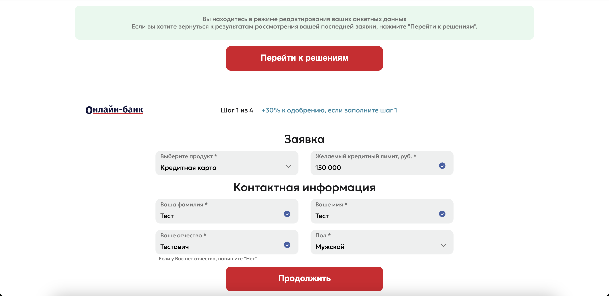

# Процесс авторизации, заполнения анкеты и получения статусов на onlinebank.pro

## 1. Процесс авторизации

- Пользователь вводит номер телефона +79967705846 на странице авторизации.

- Фронтенд отправляет запрос на эндпоинт `/api/authorization/` в сервисе user-sign-in.

- Пользователь получает код 2000 и вводит его для подтверждения.

- После успешной авторизации пользователь получает доступ к личному кабинету.

## 2. Заполнение анкеты
- Пользователь заполняет анкету, указывая необходимые данные (ФИО, паспортные данные, контактная информация и т.д.). Нажимает кнопку "Отправить".

- При отправке анкеты фронтенд обращается к эндпоинту `/api/form/` в проекте user-form.
- Данные анкеты сохраняются в коллекции users в MongoDB.

## 3. Отправка заявок партнерам

- После заполнения анкеты формируется заявка.
- Фронтенд отправляет запрос на эндпоинт `/api/application/` в сервисе user-application.
- Заявка сохраняется в коллекции form в MongoDB с уникальным идентификатором form_id.
- Заявка отправляется партнерам (Банк1, Банк2, МФО1).

## 4. Получение статусов от партнеров

### a) Банк1
- Отправляет Excel-отчет на почту report@mail.ru.
- Сервис get-status парсит почту каждый час.
- Обрабатывает данные и обновляет статусы в таблице status в PostgreSQL.

### b) Банк2
- Использует постбэк, отправляя данные на эндпоинт `/api/postback/` в сервисе get-status.
- Сервис обрабатывает полученные данные и обновляет статусы в БД.

### c) МФО1
- Сервис get-status выполняет GET-запросы каждый час для получения статусов заявок за последний час.
- Полученные статусы обрабатываются и сохраняются в БД.

## 5. Хранение данных

### MongoDB:
- Коллекция users: хранит анкеты пользователей.
- Коллекция form: хранит заявки.

### PostgreSQL:
- Таблица status: хранит статусы одобрения заявок (1 - одобрено, 0 - отклонено).

## 6. Анализ кода сервиса get-status

Предоставленный код относится к сервису get-status и выполняет следующие действия:

1. Итерируется по обработчикам (handlers) и банкам.
2. Для каждого банка из списка banks:
    - Получает таблицу данных с помощью функции get_table().
    - Выводит эту таблицу.
    - Создает временную метку.
    - Инициализирует списки для отчетов о дублированных UTM, вставленных UTM и сравнения статусов UTM.
    - Вызывает функцию handler() для обработки данных банка.
    - Если есть дублированные UTM, создает файл отчета.
    - Вызывает функцию insert_or_update_statuses() для вставки или обновления статусов в базе данных.
    - Создает файлы отчетов для вставленных UTM и сравнения статусов UTM, если есть данные.

Этот код является частью процесса обработки данных, полученных от партнеров, обновления статусов в базе данных и создания отчетов о различных аспектах обработки.

## Схема процесса

